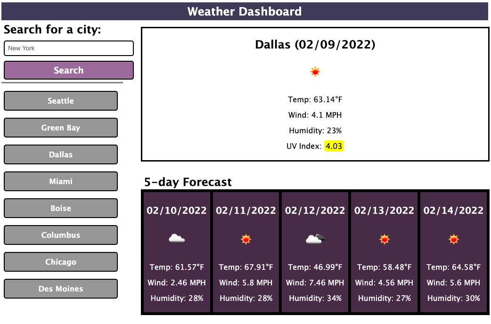

# WeatherApp

## My Task

The task for this app is to create an interface that allows a user to search a city and view weather info about that city. Included in this weather info is temperature, wind speed, humidity and UV Index. When a city is searched for, both the current weather for today and a 5 day forecast is displayed on the screen. After each search, the 8 most recent searches are displayed below the search bar and can be clicked to view the weather results for that city.

## Mock-Up
 
Below is an example of the interface:

## Languages
 
* HTML
* CSS
* JavaScript

## Website & Repository

* Github: https://github.com/anthonypacella/WeatherApp
* Deployed Website: https://anthonypacella.github.io/WeatherApp/